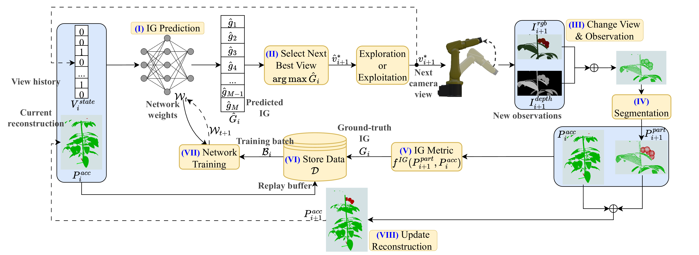

# SSL-Semantic-NBV

<p align="center">
  <a href="./index.html"> <strong>Project</strong></a> ·
  <a href=""> <strong>Paper</strong></a>
</p>

<p align="center">
  
</p>

## Requirements

- Ubuntu 20.04
- ROS Noetic
- Python 3.8

## Installation

### Install dependencies

#### Optional: PyKDL

```bash
git clone https://github.com/orocos/orocos_kinematics_dynamics
cd orocos_kinematics_dynamics/orocos_kdl/
mkdir build && cd build
cmake -DCMAKE_BUILD_TYPE=Release ..  # Run outside a Conda environment.
make -j12  # Adjust 12 to the number of CPU threads.
sudo make install

cd ../../python_orocos_kdl/
git submodule update --init
mkdir build && cd build
cmake -DCMAKE_BUILD_TYPE=Release -DPYTHON_VERSION=3 ..
make -j12
cp devel/lib/python3/dist-packages/PyKDL.so /path/to/your/python/env/lib/python_version/site-packages/PyKDL.so
```

The cloned repository can be removed after copying `PyKDL.so` into your Python environment.

#### ROS packages

```bash
sudo apt-get install ros-noetic-octomap-msgs
sudo apt-get install ros-$ROS_DISTRO-moveit-visual-tools
rosdep install --from-paths src --ignore-src -r -y
bash /src/install/install_ros_dependencies.sh
```

#### Python packages

```bash
pip install rospkg
pip install torch==1.11.0+cu113 torchvision==0.12.0+cu113 torchaudio==0.11.0 --extra-index-url https://download.pytorch.org/whl/cu113
pip install --no-index --no-cache-dir pytorch3d -f https://dl.fbaipublicfiles.com/pytorch3d/packaging/wheels/py38_cu113_pyt1110/download.html
pip install defusedxml open3d torch_scatter
```

### Build

```bash
catkin_make -DCMAKE_BUILD_TYPE=Release
```

## Experiments

Activate your Python 3 environment before running the project.

### Set up the environment

```bash
source ./devel/setup.bash
roslaunch camera_bringup camera_bringup.launch
```

### Train

```bash
# Simulation
roslaunch drl_nbv_plan ssl_nbv_train.launch

# Real world
roslaunch drl_nbv_plan ssl_nbv_train_RW.launch
```

### Evaluate

```bash
# Compare planners in simulation
roslaunch drl_nbv_plan ssl_nbv_compare_diff_planners.launch

# Compare planners with heavy occlusion
roslaunch drl_nbv_plan ssl_nbv_compare_diff_planners_heavy_occlusion.launch

# Test semantic awareness
roslaunch drl_nbv_plan ssl_nbv_test_semantic_awareness.launch

# Compare planners in the real world
roslaunch drl_nbv_plan ssl_nbv_compare_diff_planners_RW.launch
```

## Citation

If you use this project, please cite the IROS 2026 paper:

```bibtex
@inproceedings{ci2026sslsemanticnbv,
  title = {{SSL-Semantic-NBV}: A Self-Supervised Learning-Based {NBV} for Target-Aware 3D Reconstruction in Agricultural Robotics},
  author = {Ci, Jianchao and Smolenova, Katarina and Wang, Xin and Streit, Axel and van Henten, Eldert J. and Kootstra, Gert},
  booktitle = {2026 IEEE/RSJ International Conference on Intelligent Robots and Systems (IROS)},
  year = {2026}
}
```
