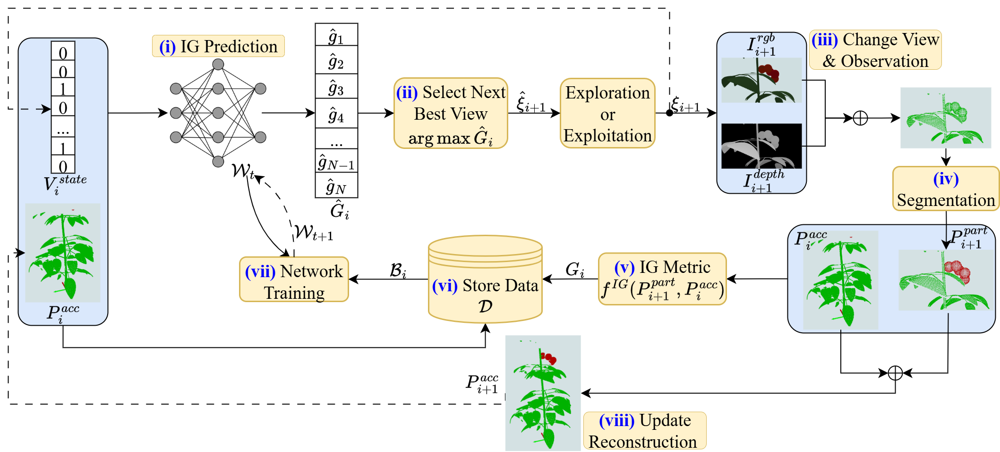

# SSL-Semantic-NBV

afsafas
## About
Accurate 3D reconstruction of task-relevant plant parts is essential for agricultural robotics applications such as harvesting, deleafing, and phenotyping, but remains challenging due to severe occlusions and plant variations. Learning-based next-best-view (NBV) methods address this by actively repositioning the camera to maximize predicted information gain (IG) via neural networks, but they require large amounts of IG-annotated data. We present SSL-Semantic-NBV, a target-aware NBV planning framework for efficient reconstruction of specific plant parts, including fruits, nodes, and whole plant, through robotic self-supervised learning. To enable efficient online learning, the framework introduces a novel IG metric for sparsely visible targets, a View Trajectory Network to encode viewpoint history, and a loss function that improves training sample efficiency under weak supervision. A GroIMP-based pipeline is introduced to automatically generate structurally realistic synthetic plants for network pre-training, facilitating real-world deployment. Experiments in simulation and real world show that SSL-Semantic-NBV outperforms baseline NBV and non-NBV methods in reconstruction efficiency and occlusion handling, while requiring significantly fewer training cycles than our previous SSL-NBV. Notably, SSL-Semantic-NBV automates the entire training process, enabling lifelong adaptation without human intervention.

## Versions

[Ubuntu 20.04](https://releases.ubuntu.com/20.04/)  
[ROS Noetic](http://wiki.ros.org/noetic/Installation/Ubuntu)

python==3.8

---
## Dependencies

1. PyKDL(optional)
```
git clone https://github.com/orocos/orocos_kinematics_dynamics 
cd orocos_kinematics_dynamics/orocos_kdl/
mkdir build && cd build
cmake -DCMAKE_BUILD_TYPE=Release ..  ##make sure you are not in conda environment(even base).
make -j12 # Change 12 to the number of threads of your cpu
sudo make install

cd ../../python_orocos_kdl/
git submodule update --init
mkdir build && cd build
cmake -DCMAKE_BUILD_TYPE=Release -DPYTHON_VERSION=3 ..
make -j12 # Change 12 to the number of threads of your cpu
cp devel/lib/python3/dist-packages/PyKDL.so /path/to/your/python/env/lib/python_version/site-packages/PyKDL.so
```
The cloned repo can be removed once the python library (*.so) is copied.


2. Some packages for ROS
```
sudo apt-get install ros-noetic-octomap-msgs
sudo apt-get install ros-$ROS_DISTRO-moveit-visual-tools
rosdep install --from-paths src --ignore-src -r -y
bash /src/install/install_ros_dependencies.sh
```
3. Some packages for Python
```
#rospkg##
pip install rospkg
##torch####
pip install torch==1.11.0+cu113 torchvision==0.12.0+cu113 torchaudio==0.11.0 --extra-index-url https://download.pytorch.org/whl/cu113
###Pytorch3D####
pip install --no-index --no-cache-dir pytorch3d -f https://dl.fbaipublicfiles.com/pytorch3d/packaging/wheels/py38_cu113_pyt1110/download.html
####defusedxml###########
pip install defusedxml
###open3d#############
pip install open3d
#####torch_scatter############
pip install torch_scatter
```
---
## Compile the project
```
catkin_make -DCMAKE_BUILD_TYPE=Release
```
---

## Execution

**Note**: Activate a virtual python3 environment before starting.

1. source the project
```
source ./devel/setup.bash
```

2. Launch the camera and gazebo setup
```
roslaunch camera_bringup camera_bringup.launch
```
3. Launch drl training 
```
# simulation
roslaunch drl_nbv_plan ssl_nbv_train.launch
# real world
roslaunch drl_nbv_plan ssl_nbv_train_RW.launch
```
4. Evaluate the model.
```
# compare with different planners in simulation
roslaunch drl_nbv_plan ssl_nbv_compare_diff_planners.launch 

# compare with different planners in simulation with heavy occlused plants
roslaunch drl_nbv_plan ssl_nbv_compare_diff_planners_heavy_occlusion.launch 

# test semantic_awareness mechanism
roslaunch drl_nbv_plan ssl_nbv_test_semantic_awareness.launch

# compare with different planners in real world
roslaunch drl_nbv_plan ssl_nbv_compare_diff_planners_RW.launch 
```
